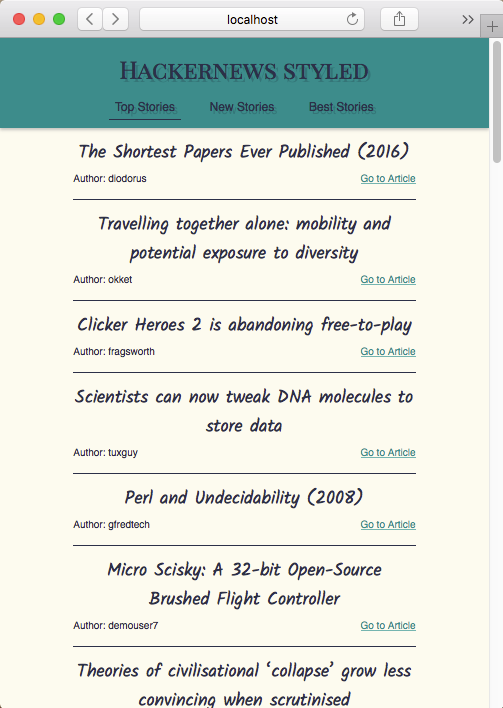

# hackernews reader

## Overview
This project was bootstrapped with [Create React App](https://github.com/facebookincubator/create-react-app)
and uses [Hacker News API](https://github.com/HackerNews/API).

## Details

To start app locally, run:

```
cd hd/
npm start
```

Runs the app in the development mode.<br>
Open [http://localhost:3000](http://localhost:3000) to view it in the browser.




### Planned Features
- add components for new and best stories
- load more stories on scroll event
